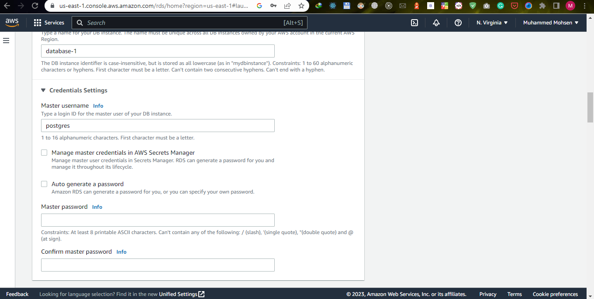
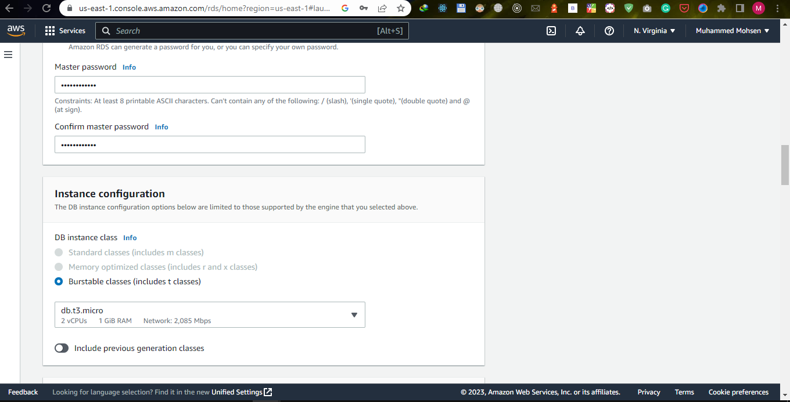
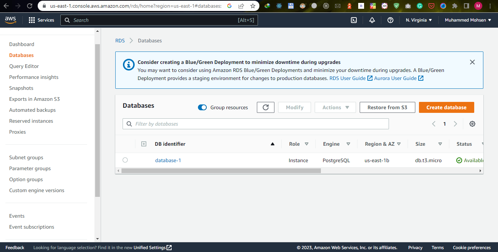

I deployed the app into AWS services .

The used services are :

- RDS : for hosting database. 
- S3 bucket : for hosting front-end application. 
- Elastic BeanStalk: for hosting the back-end application. 

The screenshots of RDS are :

The screenshots of ElasticBean Stalk:

The screenshots of S3 service :

The diagram of deploying process is :

## notes :  
-I used my Personal AWS account.

## active links for AWS services : 
- for RDS : database-1.cq0aeufcfpy2.us-east-1.rds.amazonaws.com. 
- for Elastic BeanStalk: http://udagram-env.eba-vj4mpjrn.us-east-1.elasticbeanstalk.com/  
- for S3_bucket : http://mybuckettestn.s3-website-us-east-1.amazonaws.com/home

## When running app after deploying to AWS services 

