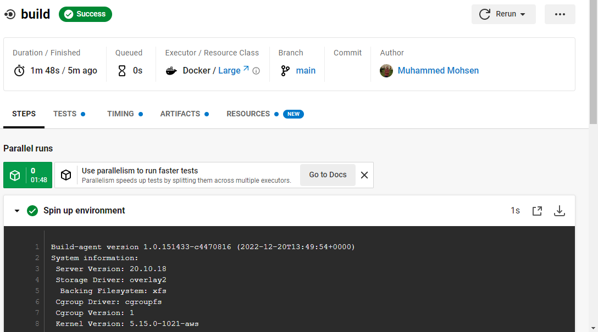
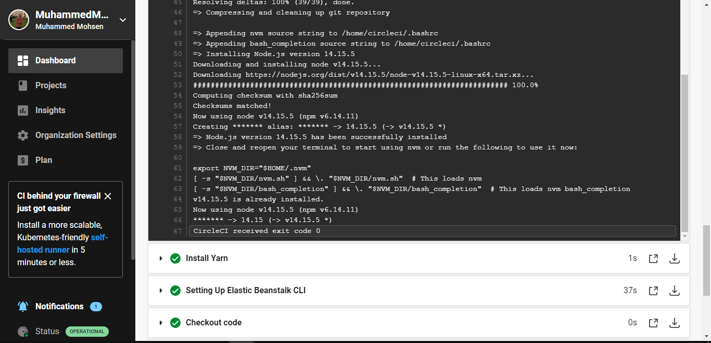

# Pipeline process 

Pipelining is a technique of breaking a sequential process into small fragments or sub-operations. The pipeline has a collection of processing segments which helps the flow of binary information. 

The diagram for this process is : 

The pipeline from myaccount is : 

## Continuous Integration | CI
 is a software development practice in which developers merge their changes to the main branch many times per day. Each merge triggers an automated code build and test sequence, which ideally runs in less than 10 minutes. A successful CI build may lead to further stages of continuous delivery.

 ## CI in our project :
 

 

 

 

 

 

 

 

 

## Continuous Deployment | CD
Continuous deployment is a strategy in software development where code changes to an application are released automatically into the production environment.

 

 

 

## Environment variables in CircleCI

 

 

 

